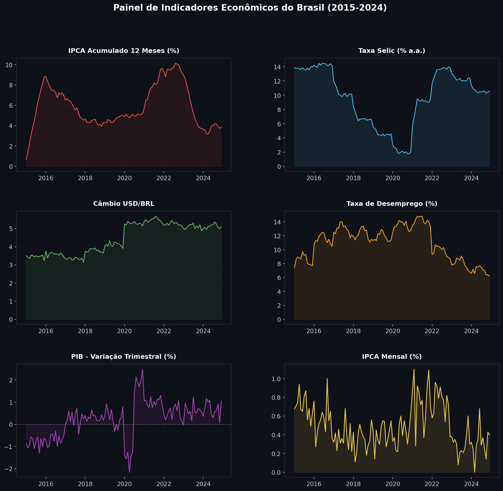
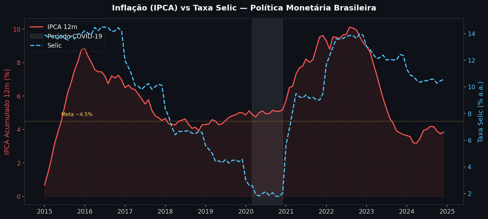
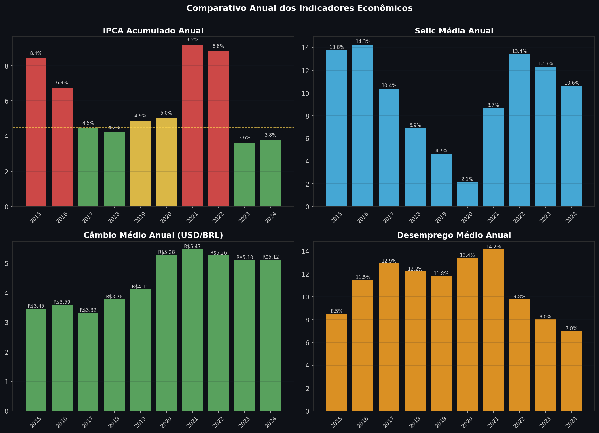
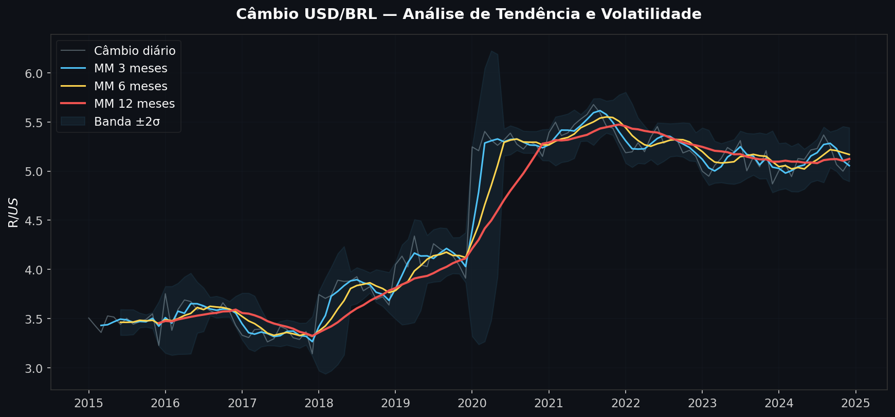
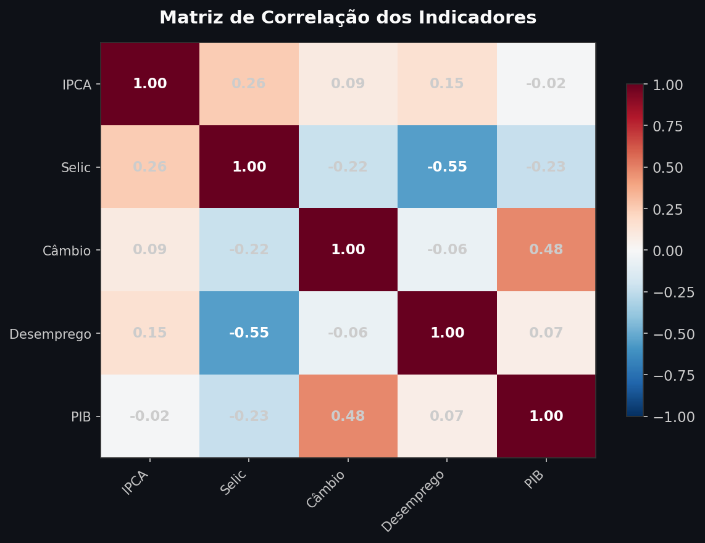

# 🇧🇷 Análise de Indicadores Econômicos do Brasil (2015–2024)

Análise exploratória dos principais indicadores macroeconômicos brasileiros ao longo de uma década, incluindo inflação, política monetária, câmbio, desemprego e PIB.


---

## 📌 Sobre o Projeto

Este projeto analisa a evolução dos indicadores econômicos do Brasil entre 2015 e 2024, um período marcado por recessão, pandemia, choques inflacionários e ciclos de política monetária. O objetivo é extrair insights sobre as relações entre os indicadores e identificar padrões relevantes para tomada de decisão.

### Indicadores analisados

| Indicador | Fonte de referência | Frequência |
|-----------|-------------------|------------|
| IPCA (inflação) | IBGE | Mensal |
| Taxa Selic | Banco Central | Mensal |
| Câmbio USD/BRL | BCB / PTAX | Mensal |
| Taxa de desemprego | IBGE / PNAD | Mensal |
| PIB (variação trimestral) | IBGE | Trimestral |

## 📊 Principais Visualizações

### Painel Geral dos Indicadores


### Inflação vs Selic — Política Monetária


### Comparativo Anual


### Volatilidade do Câmbio com Médias Móveis


### Matriz de Correlação


## 🔍 Principais Insights

1. **Ciclos de política monetária são claramente visíveis**: a Selic acompanha a inflação com defasagem de 3-6 meses, evidenciando a atuação do Banco Central.

2. **COVID-19 como ponto de ruptura**: a pandemia causou queda simultânea da Selic (mínima histórica de ~2%) e disparada do câmbio, rompendo padrões anteriores.

3. **Câmbio e inflação correlacionados**: a desvalorização do real a partir de 2020 contribuiu para o choque inflacionário de 2021-2022 (pass-through cambial).

4. **Desemprego estrutural**: mesmo com a recuperação do PIB pós-2020, o desemprego permaneceu elevado até 2022, indicando histerese no mercado de trabalho.

5. **2024 mostra convergência**: inflação e desemprego em queda simultânea sugerem um cenário macroeconômico mais equilibrado.

## 🛠️ Tecnologias Utilizadas

- **Python 3.12** — Linguagem principal
- **Pandas** — Manipulação e análise de dados
- **NumPy** — Cálculos estatísticos
- **Matplotlib** — Visualizações customizadas
- **SQL** — Consultas analíticas (Window Functions, CTEs, agregações)

## 📁 Estrutura do Projeto

```
analise-indicadores-economicos-brasil/
│
├── data/
│   └── indicadores_economicos_brasil_2015_2024.csv
│
├── src/
│   ├── gerar_dados.py              # Geração do dataset
│   └── analise_exploratoria.py     # Análise + visualizações
│
├── sql/
│   └── consultas_indicadores.sql   # 7 queries analíticas
│
├── visualizacoes/
│   ├── 01_matriz_correlacao.png
│   ├── 02_painel_indicadores.png
│   ├── 03_ipca_vs_selic.png
│   ├── 04_analise_anual.png
│   └── 05_volatilidade_cambio.png
│
├── requirements.txt
├── .gitignore
└── README.md
```

## 🚀 Como Executar

```bash
# Clone o repositório
git clone https://github.com/seu-usuario/analise-indicadores-economicos-brasil.git
cd analise-indicadores-economicos-brasil

# Instale as dependências
pip install -r requirements.txt

# Gere o dataset
python src/gerar_dados.py

# Execute a análise
python src/analise_exploratoria.py
```

## 💡 Próximos Passos

- [ ] Conectar à API do Banco Central (`python-bcb`) para dados reais
- [ ] Adicionar dashboard interativo com Streamlit ou Power BI
- [ ] Implementar modelo de previsão (ARIMA / Prophet) para a inflação
- [ ] Incluir análise de sentimento de notícias econômicas

## 📬 Contato

**[Ana Luiza Marum]** — Analista de Dados

[](https://linkedin.com/in/analuizamarum)
[](mailto:analuizamarumm@gmail.com)

---

> *Este projeto foi desenvolvido para fins de portfólio e aprendizado. Os dados são sintéticos, gerados para simular tendências reais dos indicadores econômicos brasileiros.*
